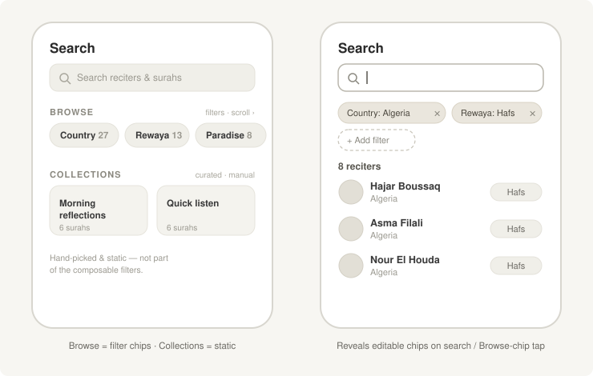

# RFC-020: composable Search filter experience

| Field  | Value                                              |
| ------ | -------------------------------------------------- |
| Status | Proposed (doc-only; code PR follows shape sign-off) |
| Date   | 2026-06-29                                          |
| Author | Omar Zarka                                          |
| Builds on | RFC-012 (composable filter dimensions in the Search tab) |

## Summary

RFC-012 established that reciter filtering should live in the Search tab as composable, user-editable chips behind an opt-in `branding.searchFilters` seam — but it left the seam shape undecided (declarative vs component-slot), deferred five open questions, and specified no actual filtering flow. This RFC resolves all of that so a code PR can proceed: it **recommends the declarative seam**, specifies a **progressive-disclosure** Search flow (rest on the curated browse page; reveal editable filter chips only when the user searches or taps a browse entry), and locks the result semantics (single-value chips, AND-composition, recitation-row mode, URL-as-state, live counts). Bayaan's default is unchanged — with `searchFilters` undefined the Search tab behaves exactly as today.

## Motivation

RFC-012 traced the core problem: the filter *destination* is already unified (`app/(tabs)/(a.home)/reciter/browse.tsx` and `app/(tabs)/(b.search)/reciter/browse.tsx` both render `components/browse/BrowseReciters.tsx`), but every "Browse by X" tile deeplinks in with a hidden, single, uneditable filter param. A user who lands on a filtered list can't see *why* it's filtered, can't relax the filter, and can't add a second dimension ("Spanish-translation reciters who recite Al-Baqarah").

What RFC-012 didn't settle is *how the user composes and edits those filters* — the interaction model. Without that, the seam is an empty contract. This RFC fills it in, so "Browse by X" can become an editable, combinable query surface instead of a set of dead-end pages.

## Decision

### 1. Seam — declarative `branding.searchFilters` (recommended)

A tenant declares which filter dimensions to surface, in chip order. The Search screen owns one shared chip UI; tenants supply only the dimension list.

```typescript
// config/branding.d.ts
export interface Branding {
  /**
   * Filter dimensions surfaced as composable chips in the Search tab,
   * in chip order. Undefined → no chips (today's behavior).
   */
  searchFilters?: SearchFilterDimension[];
}

export type SearchFilterDimension =
  | 'rewaya'            // Reciter.rewayat[].name (exists today)
  | 'has-surah'         // surah picker → Reciter.rewayat[].surah_list includes (exists today)
  | 'has-photo'         // Reciter.image_url present (exists today)
  | 'recitation-style'  // Reciter.rewayat[].style (exists today)
  | 'country'           // requires a Reciter.country field (see prerequisite)
  | 'translation';      // requires a Reciter.translation field (see prerequisite)
```

This is recommended over a per-tenant component slot (RFC-012's Option B): a shared chip UI keeps the *interaction* consistent across tenants while letting each pick its *content*. The component-slot route hands every fork a blank composer to rebuild — more divergence, no shared patterns — and is the wrong trade for a filter UX every tenant wants the same way.

**Field prerequisite (per tenant, not assumed):** `rewaya`, `has-surah`, `has-photo`, and `recitation-style` resolve against fields that exist on `Reciter` / `Rewayat` today. `country` and `translation` first need those fields added to `Reciter` (`data/reciterData.ts`) and populated from the catalog; a tenant listing a dimension whose field is absent should get a dev-time warning and a no-op chip. Bayaan can ship the four exists-today dimensions immediately.

### 2. Flow — progressive disclosure

The Search tab does not open onto a wall of filter controls. It **rests on the curated browse page** and reveals the filter composer only on a deliberate action.



**Resting state** (the Search tab's landing) has two deliberately distinct regions:

- **Browse** — the filter *dimensions* themselves, surfaced as a horizontally-scrollable row of **chips** (Country, Rewaya, Reciters, Surahs, … each with a live count). A chip is the on-ramp into the composer for that dimension. This is the only region `searchFilters` governs.
- **Collections** — curated, editorially-chosen lists (system playlists, themed sets). These are **manual and static**: tapping one opens its fixed list, unaffected by any filter. They deliberately sit **outside** the composable-filter model.

No filter *controls* are open at rest, so today's browse mental model is preserved. The split matters: it keeps "compose a query" (Browse) and "open a hand-picked list" (Collections) as two separate mental models sharing one landing, rather than blurring editorial content into the filter system.

**Compose state** (revealed, never the default): the chip composer + live results, opened by exactly one of:
1. **Tapping the search bar** → empty composer, free-text + "Add a filter".
2. **Tapping a Browse chip** → composer with that dimension's value picker open.
3. **Arriving via a "Browse by X" deeplink** (`/(tabs)/(b.search)/reciter?country=algeria`) → composer with that filter **pre-applied and removable**.

In the compose state each active filter is a chip with a visible remove affordance; an "Add a filter" control opens the dimension palette; results update live below. Re-entering the Search tab resets to the resting state, so a stale filter never persists across visits.

### 3. Result semantics

| Question (RFC-012 open Q) | Decision |
| --- | --- |
| Single- vs multi-value per dimension (Q1) | **Single value per dimension** in v1. Multi-value (OR *within* a dimension) is a usage-gated follow-up. |
| How dimensions combine | **AND across dimensions** (intersection): Country=Algeria *and* Rewaya=Hafs — composing different dimensions narrows the set. Multi-value OR *within* a single dimension is a deferred follow-up (see Q1). |
| Chip ordering (Q2) | **Declaration order** of `branding.searchFilters` — tenant-controlled. |
| Reciter- vs recitation-result rows (Q3) | Result rows switch on `has-surah`: when active, rows are `(reciter, rewaya)` recitation tuples; otherwise reciter cards. |
| Deeplink / URL behavior (Q4) | **URL-as-state via `router.setParams`** (in-place, not `push`) — deeplinks stay shareable; the back stack isn't polluted by chip edits. |
| Chip ergonomics (Q5) | Active chips render **inline** (wrap is fine — count is bounded by the dim list); value **selection** happens in a sheet/modal. |

**Live counts** on Browse chips and result headers; an empty combination shows an explicit empty state ("No reciters match Country: X + Rewaya: Y") rather than vanishing, so the user can see which filter to relax.

### 4. Browse-by-X becomes a deeplink, not a screen

Each "Browse by X" entry point collapses to a deeplink into the Search compose state with the chip pre-set:

```tsx
// → /(tabs)/(b.search)/reciter?country=algeria  (chip: Country: Algeria, removable)
<BrowseByTile filter={{ country: 'algeria' }} label="Algeria" />
```

The carousel/grid entry points stay; only their destination changes — from a fixed filtered list to an editable filtered query.

### What does not change

- `BrowseReciters.tsx` filtering predicates and grid/flat-list rendering.
- Home/Listen-tab row gating (`branding.homeRowConfig`, RFC-007).
- **Curated collections stay manual.** `searchFilters` governs the reciter *filter* dimensions only. Curated/editorial content — system playlists, themed collections — remains static and is never composed by chips. The two regions coexist on the Search landing but are separate systems; this RFC does not touch collections.
- Bayaan with `searchFilters` undefined: byte-for-byte today's behavior.

## Alternatives considered

- **Component-slot seam (RFC-012 Option B).** Rejected: each fork rebuilds its own composer; the interaction model diverges per tenant. The declarative seam shares the flavor and localizes only the content.
- **Filters on `BrowseReciters` instead of Search.** Rejected: Search is where users expect to *compose* a query; `BrowseReciters` is a "render a filtered list" surface. Putting the composer there muddles the two.
- **Filter controls always visible on the Search landing.** Rejected: it buries the curated content users currently open Search for. Progressive disclosure keeps the resting page calm and reveals the composer on intent.
- **Status quo (per-tile filtered screens).** Rejected: duplicated hidden-filter UI; the platform's combine-filters capability stays invisible.

## Consequences

- **Positive:** one place to compose and edit reciter filters; "Browse by X" stops being a dead end; the combine-dimensions capability becomes visible; new dimensions are a small declarative add per tenant.
- **Neutral:** the curated Search landing and the Home/Listen carousels are unchanged; Bayaan opts in when ready.
- **Negative / risk:** a chip-backed deeplink may not read as *editable* (mitigation: a visible remove affordance on every chip + the named empty-state). Each dimension's value picker adds bundle weight (mitigation: lazy-load pickers).

## How we'll know it worked

- With `searchFilters: undefined`, the Search tab is unchanged (no chips, curated landing intact).
- Every "Browse by X" entry lands on a Search view whose pre-applied filter is shown as a **removable** chip.
- A user can add a second dimension and the result set is the **intersection**; removing a chip widens it live.
- A filtered view's URL round-trips as a shareable deeplink.
- An empty combination shows the named empty state, not a blank list.

## Open questions

- **Multi-value within a dimension** (Country: Algeria + Morocco) — deferred to a follow-up gated on real usage; v1 is single-value.
- **First-run discoverability** — whether deeplink-arrivals need a one-time "tap × to edit filters" tooltip, or whether the chip affordance is enough. Decide during implementation from the mock.

## Code-PR plan (after shape sign-off)

Doc-only on landing. The follow-up code PR (≈600 LOC / ~10 files):

1. Extract the `has-surah` → `(reciter, rewaya)` flat-list out of `BrowseReciters` into a shared `<RecitationsList>`.
2. `<SearchFilters>` chip composer in `components/search/` — reads `branding.searchFilters`, one chip widget per declared dim, plus per-dim value pickers (reusing the existing country / surah pickers).
3. `useURLFiltersAsChips` hook — URL-state ↔ chip-state via `router.setParams`.
4. Search-tab progressive disclosure (resting ↔ compose) + the result-row mode switch.
5. "Browse by X" entry points flip `href` to deeplink into Search.
